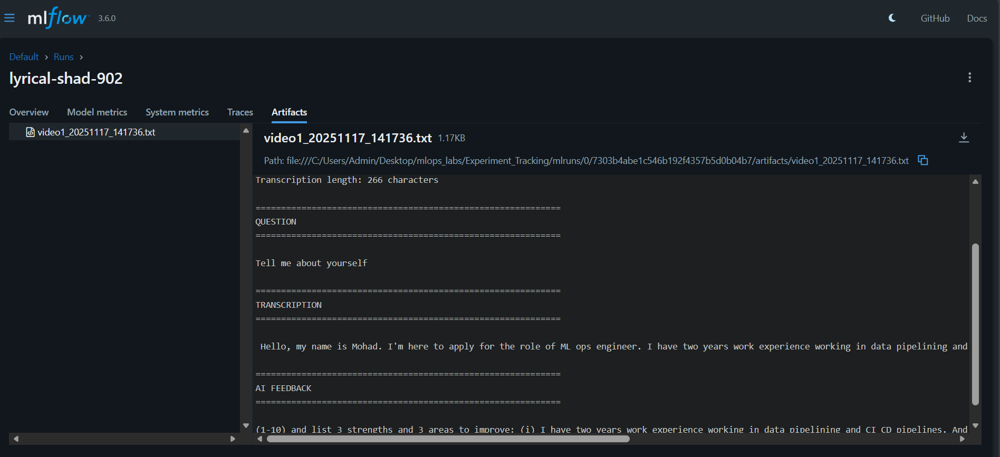

# Interview Analysis Lab (Experiment Tracking)

## Overview
- Runs analysis on interview (or pitch) videos using pre-trained models for speech-to-text and NLP feedback.
- Saves results to text files and tracks metrics (video path, question, transcription length, answer score) to MLflow for reproducibility and visualization.

## Usage
1. Run analysis:
   python main.py
2. View experiment results:
   mlflow ui  # Open http://localhost:5000

## Requirements
- Python 3.x
- ffmpeg
- torch
- transformers
- mlflow

## Output:

